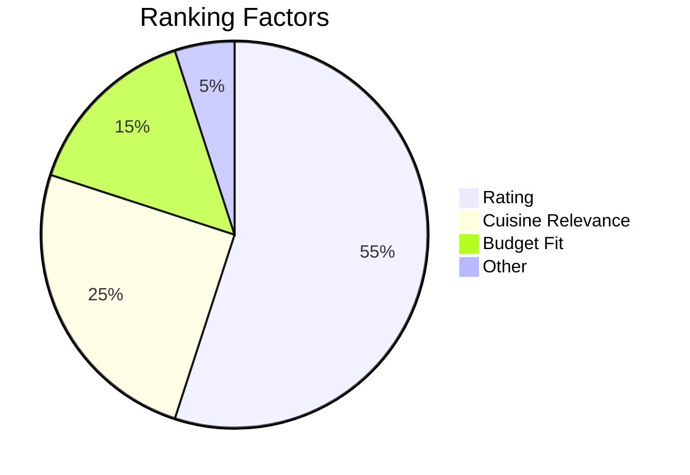

# Restaurant Recommendation System 🍣🚀

Tell me your craving and city, and I’ll serve up the best nearby restaurants with ratings and key details — fast. Built with Python + Flask, clean templates, and a tidy data pipeline that’s easy to extend to live APIs.

[Open Repository](https://github.com/AshmitThakur23/Restaurant-Recommendation-System)


---

## Elevator Pitch ⏱️

- 60 seconds from clone to first recommendation.
- Recruiter-friendly: clear visuals, clean structure, and architecture diagrams.
- Future-ready: swap CSV for a real API without rewriting the app.

---

## Demo Gallery (updated) 📸

Old screenshots removed. These are the latest images currently in the repo root. Filenames contain spaces, so the paths are URL‑encoded to render on GitHub.

<p align="center">
  
  <br/>
  <em>Landing — friendly search for cuisine + location.</em>
</p>

<p align="center">
  
  <br/>
  <em>Results — ranked suggestions with ratings and tags.</em>
</p>

<p align="center">
  
  <br/>
  <em>Filters — refine by cuisine, budget, and more.</em>
</p>

<p align="center">
  
  <br/>
  <em>Details — compact card with rating, cuisine, and quick info.</em>
</p>

<p align="center">
  
  <br/>
  <em>Responsive — polished experience on mobile and desktop.</em>
</p>

---

## Signature Features 🌟

- 🔎 Natural queries: “spicy Indian,” “budget sushi,” “vegan brunch.”
- ⭐ Smart ranking: rating ➜ cuisine relevance ➜ price fit.
- 🧭 Filters: cuisine, city, budget.
- ♿ Accessible UI: labeled inputs, keyboard navigation, readable contrast.
- 🧱 Clean Flask layout: `templates/`, `static/`, `app.py`, `zomato.csv`.

---

## System Overview 🧠

```mermaid
flowchart TD
  Q[User Query: cuisine + city + (budget)] --> C[Flask Controller]
  C --> N[Normalize / tokenize]
  N --> D[(zomato.csv)]
  D --> F[Filter by city + cuisine]
  F --> R[Rank: rating • relevance – price_penalty]
  R --> K[Top K]
  K --> V[templates/results.html]
```

Ranking intuition:



---

## Tech Stack ⚙️

- Backend: Python (Flask, Jinja2)
- UI: HTML + CSS (responsive; minimal JS)
- Data: `zomato.csv` (swap for live APIs later)
- Optional: `pandas` for fast filtering

---

## Project Structure 📁

```
Restaurant-Recommendation-System/
├─ static/                 # CSS, images, JS
├─ templates/              # Jinja2 templates
├─ app.py                  # Flask routes & controllers
├─ zomato.csv              # Sample dataset
├─ README.md
├─ Screenshot 2025-10-23 222930.png
├─ Screenshot 2025-10-23 230053.png
├─ Screenshot 2025-10-23 233608.png
├─ Screenshot 2025-10-23 233613.png
└─ Screenshot 2025-10-23 233618.png
```

---

## Quick Start 🚀

1) Clone
```bash
git clone https://github.com/AshmitThakur23/Restaurant-Recommendation-System.git
cd Restaurant-Recommendation-System
```

2) Create a virtual environment
```bash
# Windows
py -3 -m venv .venv && .\.venv\Scripts\activate
# macOS/Linux
python3 -m venv .venv && source .venv/bin/activate
```

3) Install dependencies
```bash
# If requirements.txt exists:
# pip install -r requirements.txt

# Minimal:
pip install flask pandas
```

4) Run
```bash
python app.py
# Open the URL shown in the terminal (commonly http://127.0.0.1:5000/)
```

---

## Extensibility Ideas 🧩

- Live API integration (Zomato-like or RapidAPI)
- Map view (Leaflet/Mapbox) with distance & directions
- Favorites, recent searches, and shareable links
- Charts (Chart.js) for cuisine trends and budget vs. rating
- Dockerfile + one‑click deploy (Render/Railway/Fly.io)

---

## Recruiter Highlights 💼

- Practical, user-centered product with clear value
- Clean Flask MVC‑style organization and templating
- Sensible ranking logic and easily swappable data layer
- Strong documentation and polished visuals

---

## Contact

- Author: [Ashmit Thakur](https://github.com/AshmitThakur23)
- Project: [Restaurant Recommendation System](https://github.com/AshmitThakur23/Restaurant-Recommendation-System)

If this project whetted your appetite, please ⭐ the repo — it helps others find it! 😄🍕
