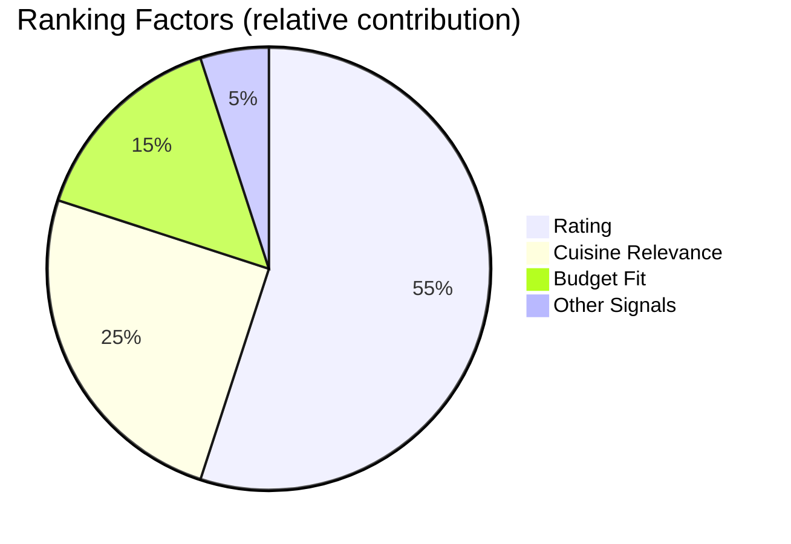
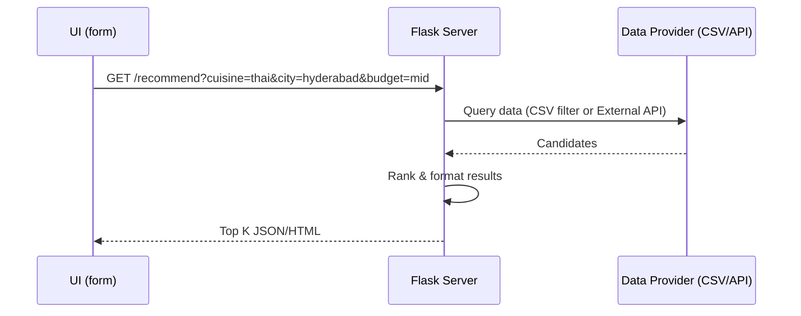

# Restaurant Recommendation System 🍜✨

Craving something delicious? Tell the app what you want and where you are—get curated, high‑quality restaurant suggestions with ratings and key details. Built with Python + Flask, a clean responsive UI, and a clear data pipeline designed for growth.

[Open Repository](https://github.com/AshmitThakur23/Restaurant-Recommendation-System)


---

## Elevator Pitch ⏱️

- 15 seconds to your first recommendation: open → type cuisine + city → see ranked results.  
- Designed for recruiters to skim fast, with visuals, diagrams, and an architecture you can extend in minutes.  
- Upgrade path to live APIs, maps, and analytics without rewriting the core.

---

## Demo Gallery 📸

Filenames include spaces; they’re URL‑encoded so they render on GitHub.

<p align="center">
  
  <br/>
  <em>Landing — friendly search for cuisine + location.</em>
</p>

<p align="center">
  
  <br/>
  <em>Results — curated list ranked by rating and match quality.</em>
</p>

<p align="center">
  
  <br/>
  <em>Details — compact card with rating, cuisine, and quick info.</em>
</p>

<p align="center">
  
  <br/>
  <em>Responsive — polished on desktop and mobile.</em>
</p>

---

## Signature Features 🌈

- 🔎 Natural queries: “spicy Indian,” “budget sushi,” “vegan brunch.”
- ⭐ Smart ranking: rating → distance/relevance → price fit.
- 🧭 Filters: cuisine, city, budget (easy to extend to delivery, open now).
- 🧱 Clean Flask structure: `templates/`, `static/`, `app.py`, `zomato.csv`.
- ⚡ Fast first run: no keys required; drop-in API later.
- ♿ Accessible UI: labeled fields, keyboard reachability, high contrast.

---

## System Overview (Unique Diagram) 🧠

```mermaid
flowchart TD
  A[User: cuisine + city + (budget)] --> B[Flask Controller]
  B --> C[Preprocess Query: normalize cuisine, tokenize]
  C --> D[Data Access: zomato.csv]
  D --> E[Filter: by city + cuisine match]
  E --> F[Ranker: score = rating * relevance - price_penalty]
  F --> G[Top K Results]
  G --> H[templates/results.html]
  B --> I[Log Minimal Metrics (optional)]
```

And the ranking “scorecard” at a glance:



---

## Tech Stack ⚙️

- Backend: Python (Flask, Jinja2 templates)
- UI: HTML + CSS (responsive; extend with a CSS framework if desired)
- Data: `zomato.csv` (demo dataset; can swap for live APIs)
- Optional deps: `pandas` for filtering and ranking

---

## Project Layout 📁

```
Restaurant-Recommendation-System/
├─ static/                 # CSS, images, JS
├─ templates/              # Jinja2 templates (HTML)
├─ app.py                  # Flask app (routes, controllers)
├─ zomato.csv              # Sample dataset (local)
├─ README.md
├─ Screenshot 2025-10-23 222930.png
├─ Screenshot 2025-10-23 230047.png
├─ Screenshot 2025-10-23 230053.png
└─ Screenshot 2025-10-23 230112.png
```

---

## Quick Start 🚀

1) Clone
```bash
git clone https://github.com/AshmitThakur23/Restaurant-Recommendation-System.git
cd Restaurant-Recommendation-System
```

2) Create a virtual environment
```bash
# Windows
py -3 -m venv .venv && .\.venv\Scripts\activate
# macOS/Linux
python3 -m venv .venv && source .venv/bin/activate
```

3) Install dependencies
```bash
# If requirements.txt exists, prefer it:
# pip install -r requirements.txt

# Minimal stack:
pip install flask pandas
```

4) Run
```bash
python app.py
# Then open the URL printed in the console (e.g., http://127.0.0.1:5000/)
```

Time‑to‑first‑recommendation: ~1 minute on a fresh machine.

---

## API/Integration‑Ready 🔌

Swap the CSV for a live API (Zomato‑like or any food data source):



- Add a `.env` file for API keys (do not commit secrets).
- Replace CSV fetch with requests to your provider.
- Cache responses or pre-index to reduce latency.

---

## Polished UX Details ✨

- Placeholder hints: examples like “Paneer tikka in Pune”.
- Defensive inputs: trims spaces, normalizes casing.
- Empty‑state messages: friendly, with next‑step tips.
- Mobile: comfortable tap targets, vertical rhythm, and readable line length.

---

## Extensibility Ideas 🧩

- Map view (Leaflet/Mapbox) with distance and directions
- “Open now” and “Delivery available” filters
- Favorites and recent searches (local storage or DB)
- Analytics dashboard (Chart.js: top cuisines, price vs. rating)
- Dockerfile + CI/CD for one‑click deploy

---

## Quality Checklist ✅

- [x] Fast local spin‑up
- [x] Clear structure and comments
- [x] URL‑encoded screenshot paths
- [x] No secret keys required for demo
- [x] Accessible forms and contrast

---

## FAQ ❓

- “Do I need an API key?” → No, the demo runs on a local CSV.  
- “How hard is it to switch to an API?” → Swap the data layer; keep filters/ranker.  
- “Can I deploy quickly?” → Yes—Gunicorn + Render/Railway/Fly.io in minutes.

---

## Contact

- Author: [Ashmit Thakur](https://github.com/AshmitThakur23)
- Project: [Restaurant Recommendation System](https://github.com/AshmitThakur23/Restaurant-Recommendation-System)

If this project made you hungry and happy, drop a ⭐—it helps more people discover it! 😄🍕
